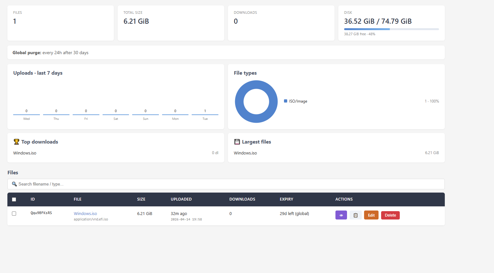
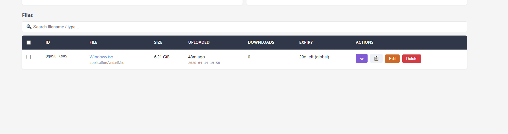
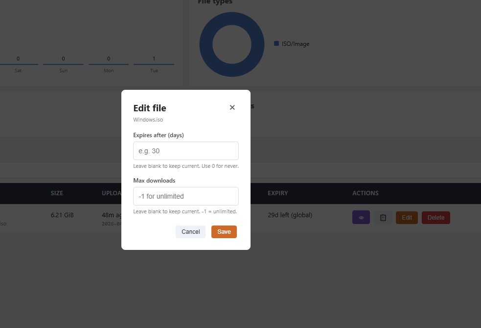
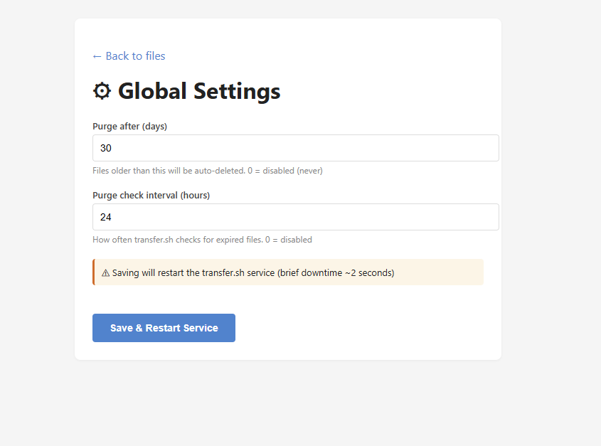

# TransferCLI

> Self-hosted file sharing with curl-first uploads and a modern web admin panel.
> Built on top of [transfer.sh](https://github.com/dutchcoders/transfer.sh).

<p align="center">
  
</p>

TransferCLI bundles [transfer.sh](https://github.com/dutchcoders/transfer.sh) with a modern web admin panel, a one-line installer, systemd units, and optional automatic HTTPS via Let's Encrypt. Upload files with `curl`, manage them from the browser.

---

## Features

### Upload
- **`curl -T`** friendly — one-line upload from any terminal
- **Streaming** — no RAM buffering, handles 10 GB+ files easily
- **Direct download URLs** — `https://your.host/ABC123/file.iso` works with `wget`
- **Per-file expiry** via `Max-Days` / `Max-Downloads` headers
- **Global auto-purge** — delete files older than N days

### Admin Panel
- **📊 Live dashboard** — files, total size, downloads, disk usage with progress bar
- **📈 Charts** — 7-day upload trend + file type donut chart
- **🏆 Leaderboards** — top downloads + largest files (disk cleanup helper)
- **🔍 Search + sort** — instant filter, click column headers to sort
- **☑ Bulk actions** — multi-select + delete
- **👁 Preview** — inline modal for images/videos/audio/PDF/text
- **📋 Copy link** — one-click share URL
- **✏ Edit expiry** — change max-days / max-downloads per file
- **⚙ Global settings** — update purge config from the UI (auto-restart)

### Privacy
- **No IP logging** (nginx `access_log off` + no uploader tracking)
- **No analytics, no cookies, no telemetry**
- Basic auth for the admin panel (nginx or in-app)

### Deployment
- **One-line install** on Debian/Ubuntu
- **Automatic HTTPS** with Let's Encrypt (when a domain is provided)
- **Systemd-managed** — autorestart, enable-on-boot
- **Single Go binary** for the admin panel (10 MB, no runtime deps)

---

## Screenshots

| Dashboard | Files & Search |
|---|---|
|  |  |

| Edit Modal | Global Settings |
|---|---|
|  |  |

---

## Quick install

**Minimal (localhost only, no TLS):**
```bash
curl -fsSL https://raw.githubusercontent.com/USER/transfercli/main/install.sh | sudo bash
```

**With domain + automatic HTTPS:**
```bash
curl -fsSL https://raw.githubusercontent.com/USER/transfercli/main/install.sh \
  | sudo TC_DOMAIN=files.example.com TC_EMAIL=me@example.com bash
```

After install, the admin credentials are printed. Access the admin at `https://your.host/admin/`.

> **Security note:** Always inspect a shell script before piping to `sudo bash`:
> ```bash
> curl -fsSL https://raw.githubusercontent.com/USER/transfercli/main/install.sh -o install.sh
> less install.sh    # review
> sudo bash install.sh
> ```

---

## Usage

### Upload with curl
```bash
# Basic upload
curl -T myfile.zip https://files.example.com/myfile.zip

# With expiry (auto-delete after 7 days)
curl -H "Max-Days: 7" -T myfile.zip https://files.example.com/myfile.zip

# With download limit
curl -H "Max-Downloads: 5" -T myfile.zip https://files.example.com/myfile.zip
```

Transfer.sh returns a URL like `https://files.example.com/AbCdEf/myfile.zip` which is directly `wget`-compatible.

### Download
```bash
wget https://files.example.com/AbCdEf/myfile.zip
```

### Admin panel
Open `https://files.example.com/admin/` in your browser. Basic auth prompt → credentials from install output.

---

## Configuration

All runtime config is done via environment variables in `/etc/transfercli.env` (transfer.sh backend) and `/etc/transfercli-admin.env` (admin panel).

### Admin panel env vars

| Variable | Default | Description |
|---|---|---|
| `TC_LISTEN` | `127.0.0.1:8082` | Admin HTTP listen address |
| `TC_UPLOADS_DIR` | `/var/lib/transfercli/uploads` | Where transfer.sh stores files |
| `TC_ENV_FILE` | `/etc/transfercli.env` | transfer.sh env file path |
| `TC_SERVICE_NAME` | `transfercli` | Systemd unit name for restart |
| `TC_BASE_URL` | *(auto)* | URL prefix for file links (derived from request if empty) |
| `TC_TITLE` | `TransferCLI` | Admin panel title |

### transfer.sh env vars (relevant)

| Variable | Default | Description |
|---|---|---|
| `PURGE_DAYS` | `30` | Auto-delete files older than N days |
| `PURGE_INTERVAL` | `24` | Purge check interval (hours) |

See [docs/config.md](docs/config.md) for full reference.

---

## Manual install

Not a fan of `curl \| bash`? See [docs/install-manual.md](docs/install-manual.md) for step-by-step instructions.

---

## Upgrading

Re-run the installer. It's idempotent and upgrades binaries in place without touching your data:
```bash
curl -fsSL https://raw.githubusercontent.com/USER/transfercli/main/install.sh | sudo bash
```

---

## Uninstalling

```bash
curl -fsSL https://raw.githubusercontent.com/USER/transfercli/main/uninstall.sh | sudo bash
```
Prompts before removing data, nginx config, and the system user.

---

## Architecture

```
                    ┌──────────────────────────┐
  Internet  ────▶   │  nginx (443, 80)         │
                    │  - access_log off        │
                    │  - TLS (Let's Encrypt)   │
                    │  - basic auth on /admin/ │
                    └──┬───────────────────┬───┘
                       │                   │
                       ▼                   ▼
              ┌────────────────┐   ┌─────────────────┐
              │  transfer.sh   │   │  transfercli-admin │
              │  127.0.0.1:8081│   │  127.0.0.1:8082 │
              └────────┬───────┘   └────────┬────────┘
                       │                    │ (reads)
                       ▼                    │
              ┌────────────────────┐◀───────┘
              │  /var/lib/transfercli │
              │  /uploads/<id>/... │
              └────────────────────┘
```

---

## Credits

TransferCLI is built on the excellent [transfer.sh](https://github.com/dutchcoders/transfer.sh) by DutchCoders. The upload backend is used unmodified; TransferCLI adds the admin panel, installer, and packaging. See [NOTICE](NOTICE) for attribution details.

## License

MIT. See [LICENSE](LICENSE).

## Contributing

Issues and PRs welcome. Keep it simple — this project's goal is to stay easy to install and maintain.
